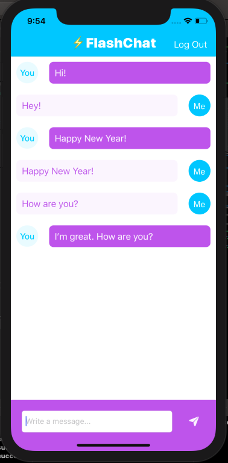
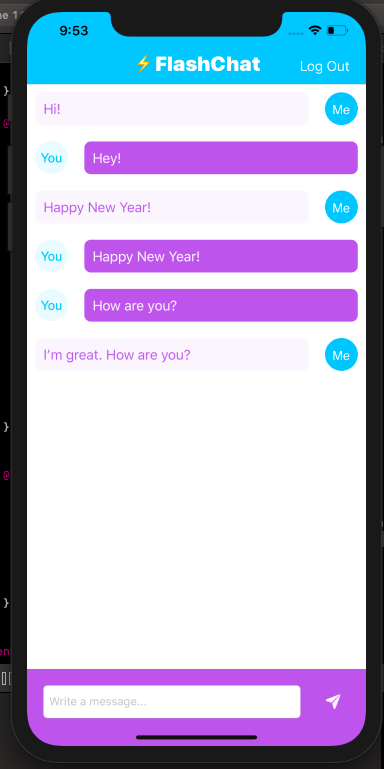

# Flash Chat
A simple iOS chat app which uses Firebase authentication and firestore database to manage users and messages.

## Screenshots
 

## To Run
- Clone repo using Xcode Source Control
- Change bundle identifier and register app on Firebase.
- Add `GoogleService-Info.plist` to project
- Enable authentication and create a new Firestore database in Firebase
- In the project add the [IQKeyboardManagerSwift](https://github.com/hackiftekhar/IQKeyboardManager) module using Swift Package Manager or by adding it to the Podfile and running `pod install`
- Run app on preferred simulator

## Requirement
- iOS 13.x
- Xcode 11.x

